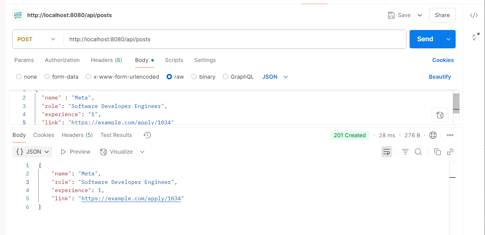
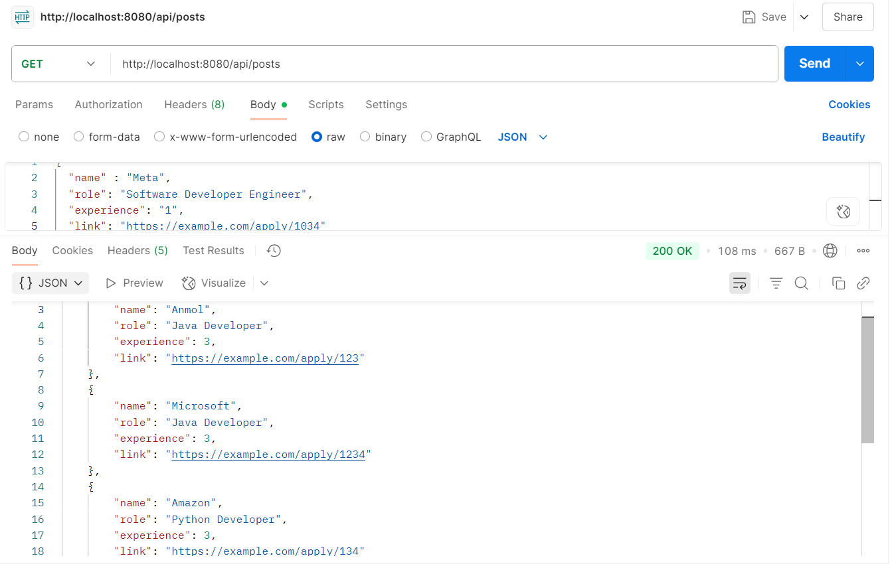
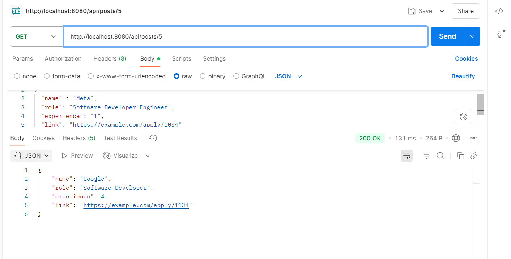

# JobHunt
JobHunt is a simple Spring Boot backend project to manage job postings by admins. It supports CRUD operations on job posts. The system stores job info in a MySQL database and exposes REST APIs for interaction.
 

---

## Features

- 🔹 Add New Job Post  
- 🔹 Update/Delete Job Post  
- 🔹 Get All Job Posts  
- 🔹 Search by Location / Experience  
- 🔹 Apply Link Must Be Unique  
- 🔹 Validations via Bean Validation  
- 🔹 DTOs to secure and shape data  
- 🔹 Exception Handling: Global + Custom  
- 🔹 Mapper Layer for Clean Architecture  

---

## REST APIs

| Method | Endpoint                    | Description                 |
|--------|-----------------------------|-----------------------------|
| GET    | `/api/posts`                | Get all job posts            |
| GET    | `/api/posts/{id}`           | Get job post by ID           |
| POST   | `/api/posts`                | Add a job post (admin only)  |
| PUT    | `/api/posts/{id}`           | Update job post              |
| DELETE | `/api/posts/{id}`           | Delete job post              |
| GET    | `/api/posts/experience/{exp}` | Filter by experience       |
| GET    | `/api/posts/role/{role}`    | Filter by role               |

# JobHunt Project Screenshots

---

